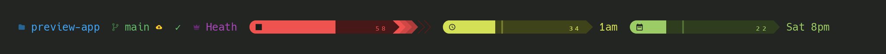
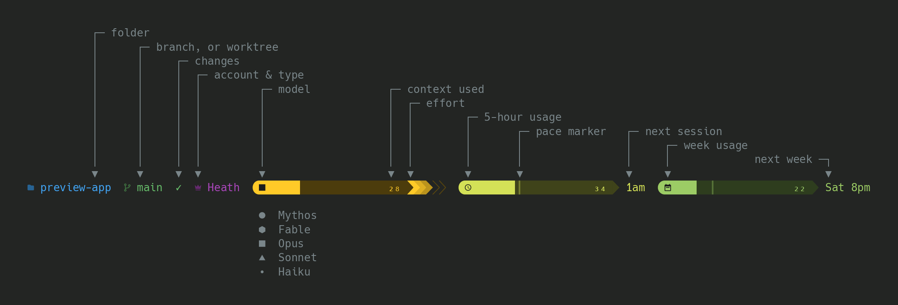
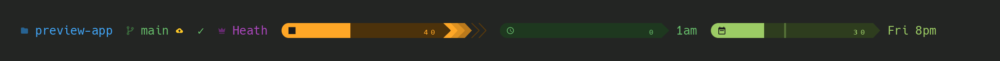
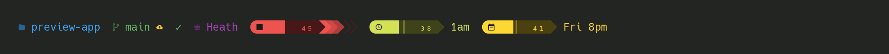
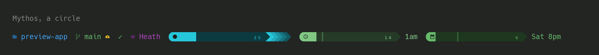
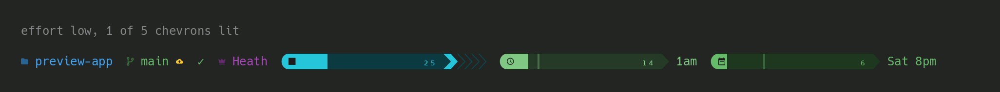
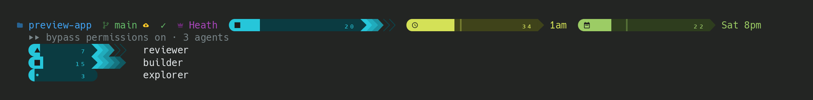
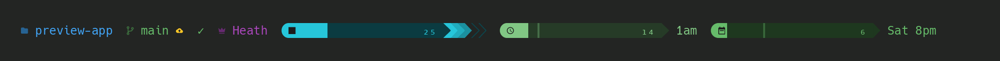

# claude-dipstick



A status line for [Claude Code](https://claude.com/claude-code). Shows context, model, session usage, week usage,
budget/cost (if applicable) and more. No dependencies.



## Install prompt

Paste this into Claude Code and it does the rest:

```
Install the status line from https://github.com/heathdutton/claude-dipstick: put statusline.sh at
~/.claude/statusline.sh, then point statusLine (refreshInterval 60) and subagentStatusLine at it
in ~/.claude/settings.json.
```

## Install

It's one file with nothing to build, so grab it:

```bash
curl -fsSL https://raw.githubusercontent.com/heathdutton/claude-dipstick/main/statusline.sh -o ~/.claude/statusline.sh
```

Then add this to `~/.claude/settings.json`:

```json
"statusLine":         { "type": "command", "command": "bash \"$HOME/.claude/statusline.sh\"", "refreshInterval": 60 },
"subagentStatusLine": { "type": "command", "command": "bash \"$HOME/.claude/statusline.sh\"" }
```

`refreshInterval` keeps the reset clocks and pace markers moving while a session idles. The second line styles the
agent panel's rows with the same script.

### Or clone it, if you want `git pull` to update it

```bash
git clone https://github.com/heathdutton/claude-dipstick ~/git/claude-dipstick
bash ~/git/claude-dipstick/tools/install.sh
```

That symlinks `~/.claude/statusline.sh` at the checkout and writes both settings keys, so a pull lands on the next
render with no re-install. `bash tools/install.sh --check` says what's wired.

### Fonts and color

Wants a truecolor terminal and a [Nerd Font](https://github.com/ryanoasis/nerd-fonts) for the bar caps, the model shapes
and the tier glyphs:

```bash
brew install --cask font-hack-nerd-font
```

Then point the terminal at Hack Nerd Font Mono. Any Nerd Font works, that one is what it's measured against. In iTerm2,
turn the non-ASCII font off or it substitutes its own glyphs for half of them.

Got neither? `MODEL_STYLE=icon`, `BAR_CAPS=half` and `BAR_STYLE=blocks` fall back to letters and plain blocks. bash 3.2
is enough, which is what macOS ships.

## The meters

Context, then the 5-hour window (), then the week (), then a budget bar
() if you set one. Each glyph rides in its bar's first cell rather than beside it, so it costs no
width. Each bar carries its number inside, right-aligned. No percent sign... a number in a meter already is one.



The  mark on the two time bars is the clock. Fill behind it means
you're under pace, ahead of it means over. Context has no clock, so it gets no marker.

Bars size themselves to the terminal.



## Model and effort

The two most obscure marks on the line. Both ride inside the context meter rather than beside it, so neither costs any
width.

### The shape is the model



It sits in the meter's first cell, sides descending as capability does:

|  |  |  |  |  |
|---|---|---|---|---|
| Mythos | Fable | Opus | Sonnet | Haiku |
| circle | hexagon | square | triangle | dot |

Geometry on purpose... a square says nothing about which vendor. It takes the bar's own coloring, knocked out on the
fill, so it reads at both ends.

### The chevrons are the effort



Haiku sends no effort level, so it gets no chevrons. Ultracode gets none either and can't. Claude Code folds it to
`xhigh` before anything here can read it.

## Subagents



Claude Code draws a panel under the prompt while agents run, and `subagentStatusLine` hands it these rows. Each one is
the same shape as the line above it. Model, effort run, and that agent's own context meter. Haiku sends no effort
level, so its row has no chevrons.

## Account, and what it costs



The same session on six accounts, the tier glyph changing ahead of the name.

|  |  |  |  |  |  |
|---|---|---|---|---|---|
| Max | Pro | Team | Enterprise | Free | API key |

A glyph for the tier, text for the name, both linking to the usage page of whoever gets billed. An API key reports no
windows at all, so the bars go and the cost turns up in their place.

Cost shows where somebody is accounting for it. An API key, a metered spend limit, or a team seat. Hidden on a personal
Max or Pro, where the number is noise. `SHOW_COST=always` overrides.

Set `WEEKLY_BUDGET_USD` and a fourth bar appears, fed by a local tally in `~/.claude/statusline-spend.tsv`. This Mac
only, and only sessions that rendered... a gauge, not an invoice.

## Where you are


Folder, then the branch () or worktree (), then clean () or
how many files are dirty (). A cloud () means the remote hasn't got your commit
yet, and  is an open PR. Everything but the dirty count is an OSC 8 link.

Root, worktree-ness and branch come off the filesystem. `git status` for the dirty count is the only subprocess, about
12ms of a 59ms render.

## Config

Defaults are a table at the top of `statusline.sh`, one line per key:

```
show_cost="${SHOW_COST-billed}"
```

Per machine, put the keys you want in `~/.claude/statusline-config.local.txt`. It's a patch: an unmentioned key falls
through, and a blank counts as a setting (`USAGE_ICON=` really does give that bar its cell back).

## Check the wiring

```bash
bash tools/selftest.sh    # what's linked, a sample render, the width fit, the locale guard
bash tools/preview.sh     # play the animations above; --gif regenerates them, --help for the rest
```

Both run against a throwaway `HOME` and a made-up account.
